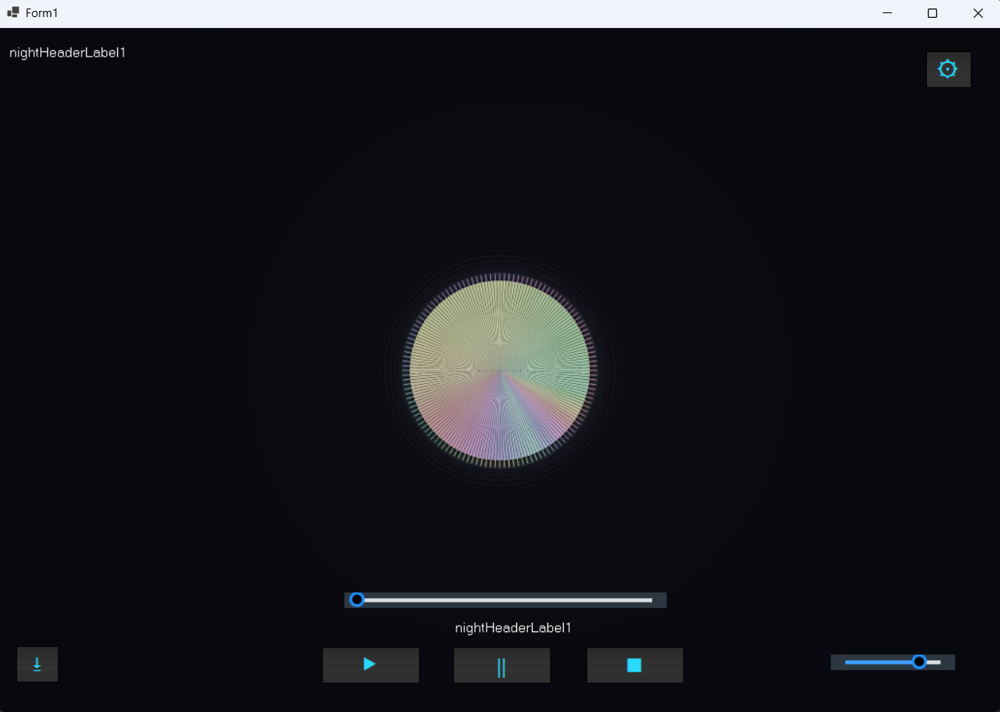

# MusicVisualizer

MusicVisualizer is a C# WinForms app that visualizes music in real 
time. It decodes audio via NAudio, runs FFT analysis on captured 
samples, and renders a pulsating ball with radial frequency bars, 
glow rings, and bass-reactive particles — all smoothly animated at 
60 FPS across three parallel threads.

## Requirements
- Windows 10/11
- .NET 8
- NAudio
- FftSharp
- ReaLTaiizor

## How to run
1. Clone the repository
2. Open `MusicVisualizer.sln` in Visual Studio
3. Build and run